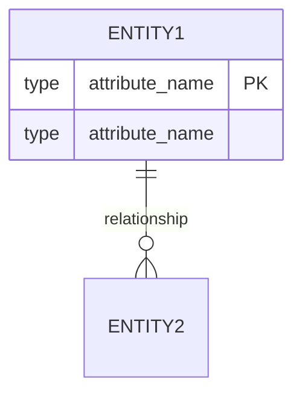

# ERD Output Template

```markdown
# Entity Relationship Diagram

**Project:** [Project Name]
**Scope:** [Core / Feature Extension]
**Date:** [Current Date]

---

## 1. Entity Catalog

| Entity Name | Description | Type | Primary Key |
|-------------|-------------|------|-------------|
| [Name] | [Brief description] | [Strong/Weak] | [PK field(s)] |

## 2. Entity Details

### [Entity Name]
**Description:** [What this entity represents]
**Type:** Strong Entity / Weak Entity (dependent on: [parent])

**Attributes:**
| Attribute | Data Type | Constraints | Description |
|-----------|-----------|-------------|-------------|
| [name] | [type] | [PK/FK/NOT NULL/UNIQUE] | [description] |

**Business Rules:**
- [Rule 1]
- [Rule 2]

> Repeat for each entity.

## 3. Relationship Specifications

| Relationship | Entity A | Entity B | Cardinality | Participation | Description |
|--------------|----------|----------|-------------|---------------|-------------|
| [verb phrase] | [Entity] | [Entity] | [1:1/1:N/M:N] | [Total/Partial] | [description] |

## 4. ERD Diagram (Mermaid)



## 5. Design Decisions & Notes

- Key assumptions made during analysis
- Alternative modeling options considered
- Questions or ambiguities requiring clarification

```

## Naming Conventions

| Element | Convention | Example |
|---------|------------|---------|
| Entities | PascalCase, singular | `Customer`, `OrderItem` |
| Attributes | snake_case | `first_name`, `created_at` |
| Relationships | Descriptive verb phrases | "places", "contains", "belongs to" |
| Primary Keys | `id` or `[entity]_id` | `id`, `customer_id` |
| Foreign Keys | `[referenced_entity]_id` | `order_id` |
