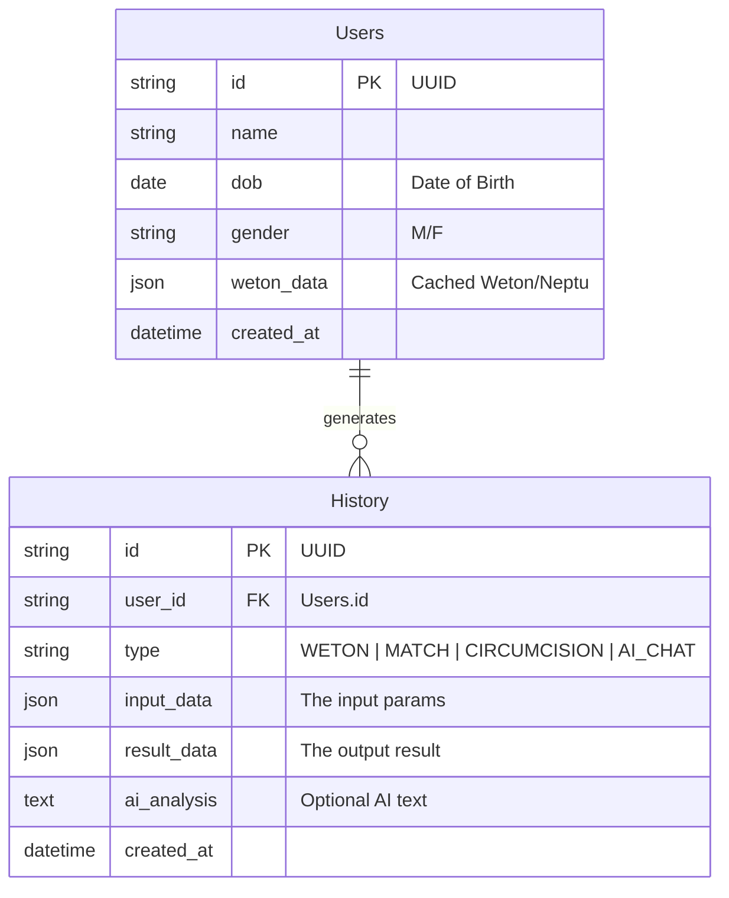

# Core Data Schema (ERD & TypeScript)

| Item        | Details                            |
|:------------|:-----------------------------------|
| **Project** | PrimbonJava                        |
| **Version** | 1.0 (MVP + Future Proof)           |
| **Status**  | Draft                              |
| **Storage** | LocalStorage (MVP) -> SQL (Future) |

## 1. Concept

This document defines the data structures.

- **MVP (Phase 1)**: Implemented as TypeScript Interfaces and stored in `localStorage` as JSON strings.
- **Future (Phase 2)**: Direct mapping to SQL Tables (`users`, `history`).

## 2. Entity Relationship Diagram (ERD)



## 3. TypeScript Interfaces (MVP Implementation)

These interfaces will be used in the React application to ensure type safety.

```typescript
// Core Types
export type Gender = "M" | "F";
export type RecordType = "WETON" | "MATCH" | "CIRCUMCISION" | "AI_CHAT";

// Entity: User
export interface UserProfile {
  id: string; // UUID v4
  name: string;
  dob: string; // ISO Date "YYYY-MM-DD"
  gender: Gender;
  weton?: {
    pasaran: string; // e.g. "Pon"
    dina: string; // e.g. "Senin"
    neptu: number; // e.g. 11
  };
  createdAt: number; // Timestamp
}

// Entity: History
export interface HistoryRecord {
  id: string; // UUID v4
  userId: string; // Foreign Key to UserProfile.id
  type: RecordType;
  input: any; // Flexible input based on type
  result: any; // Flexible result based on type
  aiAnalysis?: string; // Markdown text from GLM-4
  createdAt: number; // Timestamp
}

// Storage Key Constants
export const STORAGE_KEYS = {
  USERS: "primbon_users_v1",
  HISTORY: "primbon_history_v1",
  SETTINGS: "primbon_settings_v1",
};
```

## 4. Future Migration Strategy (SQL)

When migrating to a backend (Postgres/MySQL):

1. **Users Table**: Maps directly to `UserProfile`. `weton` becomes a JSONB column or separate columns.
2. **History Table**: Maps directly to `HistoryRecord`. `input` and `result` become JSONB columns.

## 5. Privacy Note

Since this data is currently stored in `localStorage`, it is strictly private to the user's device. No GDPR/Consent is strictly required for MVP, but a notice is good practice.
